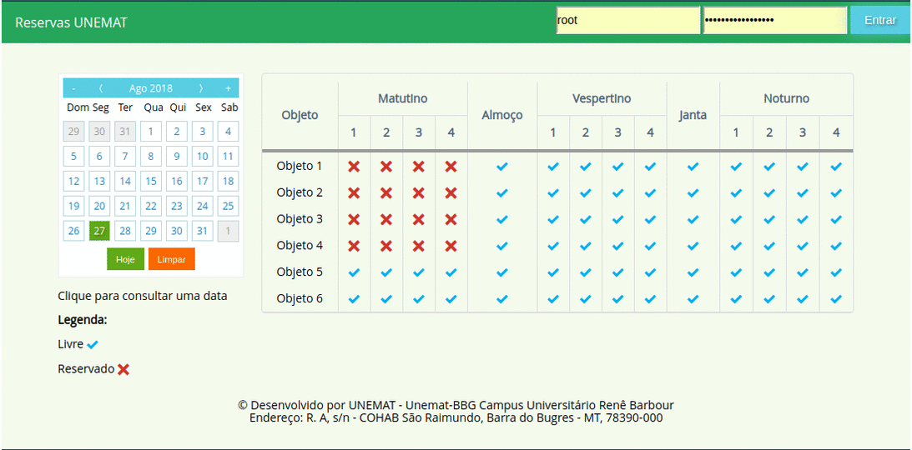

# Sistema-de-Reservas---UNEMAT
Sistema de reservas de salas, laboratórios e equipamentos utilizado na Universidade do Estado de Mato Grosso, Campus Universitário de Barra do Bugres no semestre de 2017/2.
<p align="center">
  
</p>

# Quais aplicações possíveis?
Pode ser utilizado para gerenciar qualquer tipo de objeto categorizável, porém será necessários fazer modificações tanto no front-end quanto back-end, caso tenha que ser utilizado fora do ambiente universitário ou em outra universidade.

# Pré-requisitos
  * Node.js 6.11.0 +
  * PostgreSQL 9.5 +
  * NPM 4.4 +

# Como fazer para utilizar esse sistema?
  * Bom, eu utilizei Linux Mint 17.3, que é baseado no Ubuntu 14.04, para desenvolver e em produção Debian 8, se for usar outra distro, Windows ou versões diferente dos requisitos pode ser que algo seja diferente.
  * Faça clone o projeto com o comando.
```bash
$ git clone https://github.com/CosmeLorim/sire-unemat.git
```
  * Atenda aos pré-requisitos, tópico anterior.
  * Com o PostgreSQL devidamente instalado instalado e usuário root devidamente configurado recomendo a criação de um usuário exclusivamente para o sistema de reservas.
  * Crie uma base de dados limpa com um nome representativo.
  * Pegue o arquivo "estrutura_v1.0.0.sql".
  * Utilizando o psql e usuário root do bando de dados, ou o usuário novo, rode o seguinte comando.
```bash
$ psql -U postgres nome_da_base < estrutura_1.0.0.sql
```
  * Agora com o npm instale as depedências do projeto, dentro da pasta do projeto rode o comando.
```bash
$ npm install
```
  * Se tudo deu certo a aplicação já tem uma base de dados, estrutura e dependências devidamente instaladas, porém ainda não há um usuário administrador, então você terá que inserir um diretamente na base, não há senha padrão, utilize o seguinte comando SQL.
```bash
  insert into usuarios (nome, usr, passwd, admin, ativo) values ('Root', 'root', '6bab6e5e6d45a17eb5a4b72140f91517', true, true);
```
  * Modifique o arquivo de configuração de conexão com o banco de dados em:
```bash
  /config/dbConnection.js
```
  * Para iniciar a aplicação basta inserir o seguinte comando no terminal:
```bash
$ node index
```
  * Se for colocar em produção recomendo o uso do PM2 para monitorar a saúde da aplicação e auto-reboot em caso de crash.

# Qual o motivo do desenvolvimento?
Havia um sistema de mesmo propósito na universidade, porém o sistema legado estava extremamente lento, além de não conseguir manter a integridade dos dados. Visto a necessidade da instituição, foi iniciado o desenvolvimento de um novo sistema de reservas com outras tecnologias.
Além disso este projeto é produto do meu estágio acadêmico enquanto estagiário da UNEMAT, campus de Barra do Bugres.

# Esse é o único sistema de reservas para salas, laboratórios e equipamentos?
Não! Decidi desenvolver um novo ao invés de utilizar algum pronto porque não encontrei sistemas parecidos que utilizasse NodeJS, que era a plataforma na qual estava interessado em aprender.

# Esse sistema está 100% pronto?
Infelizmente não, outras funcionalidades estavam em desenvolvimento quando fui movido de setor, além de existir bugs, alguns corrigidos na próxima release que nunca foi para produção, há um branch chamada "develop" com algumas funcionalidades não finalizadas.

# Discussões
Para iniciar uma discussão basta clicar em “New issue” na página de discussões. Se possível rotule a discussão com um tipo apropriado: Bug, Docs, Dúvida, Melhoria, Função, Manutenção, ou DevTools.
